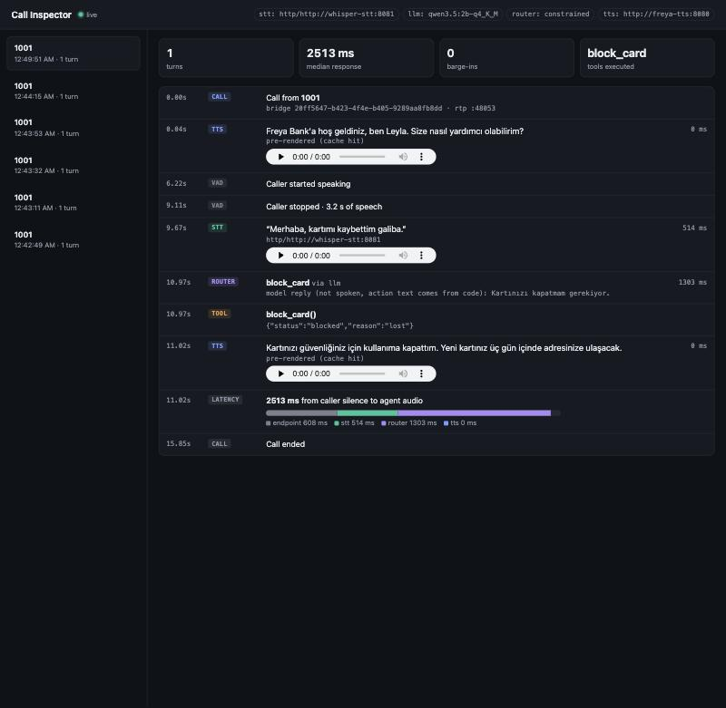

# Asterisk + FreyaTTS on Kubernetes

A home-scale, on-prem **AI phone line for a bank**: a caller dials in over SIP, speaks Turkish, and an agent
answers with [FreyaTTS](https://github.com/freyavoiceai/FreyaTTS), blocks a lost card, reads the statement,
or warm-transfers to a human. It runs on **Kubernetes with a GPU node and no internet egress**, installs with
one Helm command, and every stage of every call is measured.

Built as an independent project to learn, end to end, what running voice AI inside a bank involves.



## What it does

```
iPhone (softphone) ──SIP/RTP──► Asterisk ──ARI + ExternalMedia RTP──► voice-agent
                                   │                                    │  Silero VAD, barge-in
                                   │ warm transfer                      ├─► whisper-stt  (GPU)
                                   ▼                                    ├─► guards → Qwen 2B (constrained JSON) → tool
                             human agent phone                          └─► FreyaTTS     (GPU)
```

* **Talk, don't press:** "Kartımı kaybettim" blocks the card; "ne kadar borcum var?" reads the statement;
  DTMF 0/1/2 still works as a fallback.
* **Barge-in:** speak over the agent and it stops and listens.
* **Warm transfer:** the human hears a spoken briefing of the caller's request before joining;
  the caller hears a hold message and Turkish ringback.
* **Safe by construction:** the model only *chooses* an action; the code executes it and speaks a fixed
  sentence, so the model cannot claim "your card is blocked" without blocking it. Deterministic guards
  route "I want a human"; an output guard blocks invented facts (opening hours, fees).
* **Degrades, never stalls:** if the LLM is unreachable, calls fall back to guards, DTMF and a human.

## Results

| | |
|---|---|
| Response time, caller stops talking → agent audio (Kubernetes, GTX 1050) | **p50 2.25 s, p95 2.48 s** |
| Routing accuracy on 14 banking utterances (Qwen3.5 2B + guards) | **14/14** |
| FreyaTTS-small real-time factor: GTX 1050 / Apple M4 GPU / M4 CPU | 0.42 / 0.29–0.38 / 0.55–0.70 |
| Egress from pods to the internet | **blocked**; only the LLM endpoint is allow-listed |
| Offline install bundle (images + chart + checksums) | 8.9 GB |


## Findings worth reading
* **FreyaTTS-small drifts to another speaker mid-utterance** on multi-clause prompts (pitch 320 Hz → 95 Hz),
  and sometimes repeats a phrase. Measured with Whisper round-trips and pitch tracking; fixed for IVR prompts
  with an ASR- and pitch-verified renderer. → [phase 1](docs/phase-1-telephony-ivr.md)
* **A 4B model said "I blocked your card" without calling the tool.** Constrained JSON tool choice made a
  2B model 14/14 and twice as fast. → [phase 2](docs/phase-2-voice-agent.md)
* **The AI line was silent while every log looked fine.** RTP debug showed zero packets to the caller:
  Asterisk 20.6 ExternalMedia dropped inbound slin16 on its dynamic payload type. G.711 µ-law fixed it, and
  the smoke test now judges the audio the caller hears, not the logs. → [phase 2](docs/phase-2-voice-agent.md)
* **Thirteen things that broke on the way to Kubernetes**: a held GPU driver vs. a kernel update, a host
  cron deleting our images, disk-pressure evictions, a crash loop when the LLM host slept, Prometheus
  losing the first event of every counter, and more. → [phase 3](docs/phase-3-kubernetes.md)

## Stack
**Telephony:** Asterisk 20 (PJSIP, ARI, ExternalMedia, DTMF RFC 4733), SIP/RTP, G.711 ·
**Speech:** FreyaTTS-small (CUDA), faster-whisper (CTranslate2 int8), Silero VAD ·
**LLM:** Qwen3.5 2B on Ollama, schema-constrained tool choice, Semantic-Kernel-style tool registry ·
**Platform:** Kubernetes (k3s), Helm, Docker/buildx, NVIDIA device plugin with GPU time-slicing,
private registry, NetworkPolicy default-deny egress, non-root pods ·
**Observability:** Prometheus, Grafana, nvidia-smi exporter, a live Call Inspector ·
**Language:** Python (asyncio, FastAPI)

## Run it

**Docker (one machine, phases 1–2):**
```bash
cp .env.example .env                       # set EXTERNAL_IP, SIP and ARI passwords
docker compose up -d                       # Asterisk
uvicorn app:app --app-dir services/tts --port 8080          # FreyaTTS (CUDA / Apple GPU / CPU)
python services/agent/main.py              # voice agent; Call Inspector on http://127.0.0.1:8090
```
Register a softphone as `1001` and dial `100` (IVR) or `200` (AI agent).

**Kubernetes (phase 3):**
```bash
sudo infra/k3s/install-gpu-node.sh gpu-node        # driver check + k3s
infra/k3s/gpu-device-plugin.sh gpu-node             # nvidia.com/gpu, then time-slicing:
helm upgrade -i nvdp nvdp/nvidia-device-plugin -n nvidia-device-plugin -f deploy/gpu/device-plugin-values.yaml
kubectl apply -f deploy/registry/registry.yaml      # images are pushed here with buildx --push
kubectl -n freya create secret generic freya-voice-secrets --from-env-file=.env
helm upgrade -i freya-voice deploy/charts/freya-voice -n freya
scripts/lab-ui.sh                                   # Inspector :8091, Grafana :3000
```
Offline site: `infra/airgap/make-bundle.sh` on a connected node, carry the bundle, run `install.sh`.

**Verify with a real call:** `python scripts/smoke_call.py --server <node-ip> --ext 200`
registers a headless softphone, speaks, and fails if the caller hears silence.

## Repository map
| path | |
|---|---|
| `telephony/asterisk` | image, PJSIP/dialplan/ARI config templates, QC'd IVR prompts |
| `services/agent` | ARI app: RTP, VAD, router, tools, warm transfer, Call Inspector |
| `services/tts`, `services/stt` | FreyaTTS and Whisper inference services (CUDA images) |
| `deploy/charts/freya-voice` | Helm chart incl. NetworkPolicy, ServiceMonitors, Grafana dashboard |
| `deploy/gpu`, `deploy/registry`, `deploy/monitoring` | device plugin, registry, kube-prometheus-stack values |
| `infra/k3s`, `infra/airgap` | node bootstrap, offline bundle |
| `bench/` | TTS, STT, LLM and router benchmarks behind every number above |
| `docs/` | one write-up per phase, including what went wrong |

## Not done yet
Honest list of what a bank deployment would still need: LLM served in-cluster (vLLM/Triton), a SIP proxy/SBC
(Kamailio or Cisco CUBE) and Genesys-style `X-` header routing, Asterisk HA, SSO (SAML/OIDC) for the UIs,
secrets from a vault such as CyberArk, logs to a SIEM such as Splunk, LLM tracing (Langfuse), and CoreDNS
locked down so public names do not resolve. Details in [phase 3](docs/phase-3-kubernetes.md#what-production-needs-beyond-this-lab).

## Credits
FreyaTTS-small and its AudioVAE2 decoder are Apache-2.0 models by Freya and OpenBMB. This project uses them
unmodified and is not affiliated with either.
