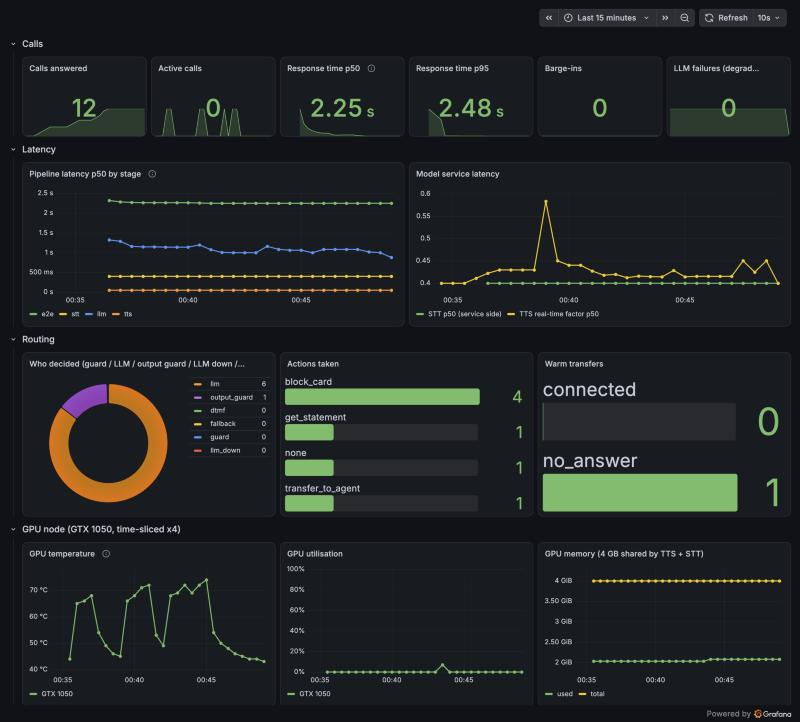

# Phase 3: Kubernetes, GPU node, zero egress

**Goal:** run the whole voice line from phase 2 on Kubernetes the way it would run inside a bank:
GPU inference scheduled by the cluster, images from a private registry, no internet egress,
one Helm command to install, and observability for latency and GPU health.

```
                 ┌──────────────────────── k3s node "gpu-laptop" (GTX 1050 4 GB) ────────────────────────┐
 iPhone ─SIP/RTP─┤ asterisk (hostNetwork) ──ARI──► voice-agent ──HTTP──► freya-tts   nvidia.com/gpu: 1   │
                 │        ▲  ExternalMedia RTP ◄──┘      │      └─HTTP──► whisper-stt nvidia.com/gpu: 1   │
                 │        │                               │                (time-sliced 1 GPU -> 4)       │
                 │  registry (127.0.0.1:5000) ◄── all images      Prometheus + Grafana, gpu-exporter      │
                 │  NetworkPolicy: default-deny egress  ─────────────┐                                    │
                 └───────────────────────────────────────────────────┼────────────────────────────────────┘
                                                                     └──► Mac mini: Ollama qwen3.5 2B (the only allowed external endpoint)
```

## What is deployed
| Piece | How |
|---|---|
| Cluster | k3s v1.36 single node (`infra/k3s/install-gpu-node.sh`) |
| GPU | NVIDIA device plugin, `runtimeClassName: nvidia`, **time-slicing** 1 physical GPU → 4 `nvidia.com/gpu` (`deploy/gpu/device-plugin-values.yaml`) |
| Images | node-local registry (`deploy/registry`), k3s mirror in `registries.yaml`; model weights baked in, `HF_HUB_OFFLINE=1` |
| App | Helm chart `deploy/charts/freya-voice`: Asterisk (hostNetwork), voice-agent, freya-tts (CUDA), whisper-stt (CUDA) |
| Security | non-root pods, dropped capabilities, seccomp RuntimeDefault, secrets created out of band, default-deny egress |
| Observability | kube-prometheus-stack, ServiceMonitors, nvidia-smi GPU exporter, "Freya Voice Lab" dashboard |
| Offline install | `infra/airgap/make-bundle.sh` → 8.9 GB bundle (images + chart + checksums), `install.sh` on the target |

## Results


| metric (12 calls, GTX 1050 + Qwen 2B on an M4 over LAN) | value |
|---|---|
| response time p50 / p95 (caller silence → agent audio) | **2.25 s / 2.48 s** |
| STT (faster-whisper small, int8 on Pascal) | ~0.4–0.5 s |
| router (guards + constrained 2B LLM) | ~1.0–1.3 s |
| FreyaTTS real-time factor on the GTX 1050 | ~0.42 |
| GPU memory, TTS + STT sharing one card | 2.1 of 4 GB |
| GPU temperature during calls | 45 °C idle → 72 °C |

Zero-egress check from inside the agent pod:

| destination | result |
|---|---|
| huggingface.co, pypi.org, 1.1.1.1 | **blocked** |
| freya-tts, whisper-stt (in-cluster) | reachable |
| LLM endpoint 192.168.1.2:11434 (allow-listed) | reachable |

**Known gap:** CoreDNS still resolves public names (`huggingface.co → 3.169.107.39`). Connections fail, but
DNS alone is an exfiltration channel. On a bank site CoreDNS must not forward upstream (or forward only
to the bank's resolver with a strict allow-list).

## Things that broke, and what they taught
Each of these happened while deploying; none showed up on the laptop-free Docker setup.

1. **A held driver vs. an automatic kernel update disabled the GPU.** The host pinned `nvidia-driver-580`;
   Ubuntu kept upgrading the kernel, whose prebuilt NVIDIA module needed a newer 580.x userland.
   `nvidia-smi` failed silently until checked. Fix: upgrade within the branch, re-hold, `modprobe`
   (no reboot). Lesson for customer sites: pin kernel and driver together, or neither.
2. **Device plugin DaemonSet with 0 pods.** The chart only targets nodes labelled by Node Feature
   Discovery. Without NFD, label the node (`nvidia.com/gpu.present=true`).
3. **Pascal support is a moving target.** CUDA 13 and PyTorch's CUDA 12.8+ wheels dropped sm_61:
   TTS uses the cu126 wheels, STT uses CTranslate2 int8 (no fast fp16 path on Pascal).
4. **Another tenant deleted our images.** A Vast.ai cron on the host removed Docker images it did not
   own every ~5 minutes, taking the TTS image between build and push. Fix: `buildx --push` straight
   to the registry, never keep lab images in the shared local store.
5. **Disk pressure evicted every pod.** Builds filled the HDD root to 84%; kubelet set `DiskPressure`,
   evicted pods and tainted the node. Freed 44 GB of build cache. On-prem, image size and node
   disk are a delivery constraint, not a detail: the TTS image alone is 5.4 GB.
6. **Non-root broke librosa.** numba caches JIT code next to site-packages, read-only for uid 10001:
   the first TTS request returned 500. `NUMBA_CACHE_DIR=/tmp/numba`.
7. **Cold GPU on the first caller.** STT warmed up on silence, which never runs the decoder: the
   first real transcription took 3.1 s, later ones 0.4 s. Warm up on noise.
8. **`envsubst` blanked Asterisk's own variables.** `Dial(PJSIP/${EXTEN})` became `Dial(PJSIP/)`, so
   phone-to-phone calls failed. Latent since phase 1; found by the first real-phone test on k8s.
   Substitute an explicit variable list only.
9. **Registrations are pod state.** A restarted Asterisk pod forgets every phone until it re-registers
   (default up to an hour). Registration expiry is now 120 s.
10. **A dependency outage crash-looped the agent (66 restarts).** With the LLM host asleep, the start-up
    warm-up threw. Now: warm-up is separate and may fail; a failing LLM degrades calls to guards,
    DTMF and a human (`source=llm_down`), with a 4 s timeout so callers are never left in silence.
11. **Grafana OOMKilled 5 times** at a 384 Mi limit while refreshing the dashboard every 10 s. 768 Mi.
12. **The first event of every counter was lost.** Prometheus takes the first scrape of a new labelled
    series as its baseline, so `increase()` dropped the first card block after each restart.
    All label combinations are created at 0 on start-up.
13. **GPU exporter panicked** on driver 580, whose `nvidia-smi` field names include units. The exporter
    now queries an explicit field list.

## GPU sharing: why time-slicing, and its limits
Time-slicing lets the TTS and STT pods take turns on one GPU. It gives **no memory or fault isolation**:
one pod can exhaust VRAM for all of them, so memory is budgeted by hand (2.1 of 4 GB used). On A100/H100,
**MIG** gives hard partitions with their own memory, and **MPS** gives concurrent kernels with limits;
neither exists on a Pascal GeForce. In production the choice is per model: latency-critical TTS/STT on
MIG slices, batch work shared.

## What production needs beyond this lab
* LLM served in-cluster (vLLM/Triton on the GPU nodes) instead of an allow-listed host.
* Asterisk HA: registrations in a shared store (or a SIP proxy/SBC like Kamailio in front), more than one
  replica, and the ARI app made multi-instance.
* Transfer briefings through shared storage or ARI uploads instead of a hostPath (single node only).
* Secrets from the bank's vault (CyberArk), SSO for Grafana/Inspector (SAML/OIDC), logs to Splunk.
* DNS locked down (above), signed images, and image scanning in the offline pipeline.
